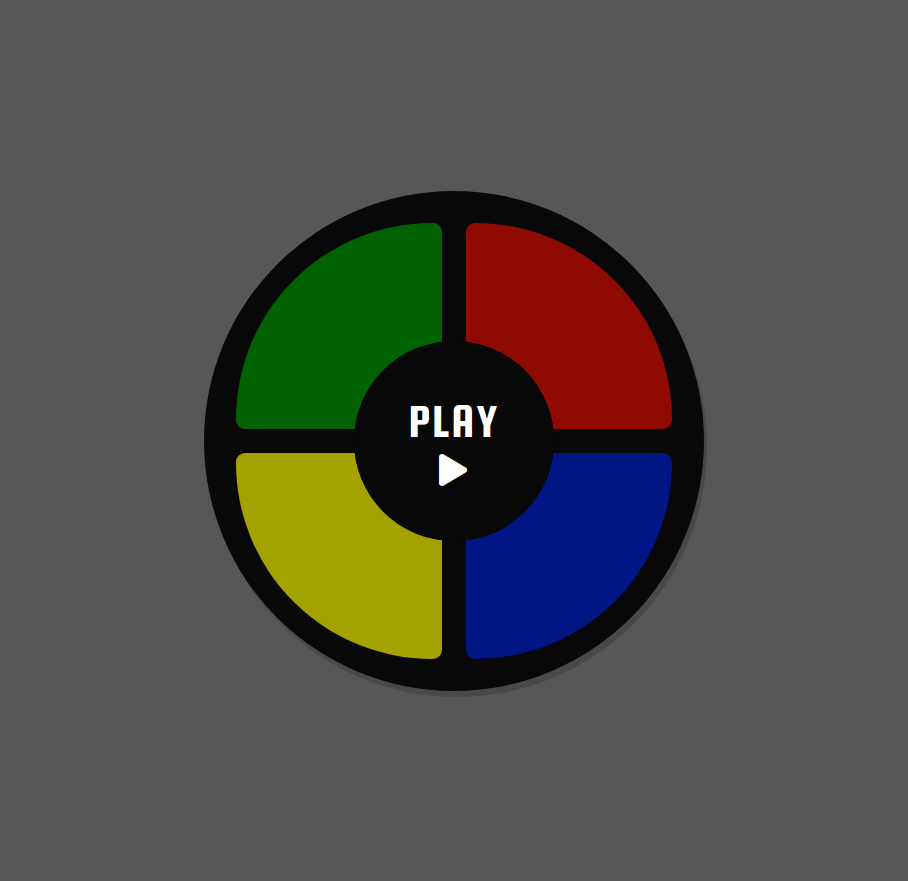

## Simon Game

Simon/Genius is an eletronic game in which you have to memorize the played sequence and try to repeat it. The more you get it right more the sequence grows and becomes faster.

## 🔨 Tecnologies

* HTML
* CSS
* JavaScript **(vanilla)**

## 🖼️ Screenshots

## 💾 Hosting

[:octocat: GitHub Pages](https://jotahdavid.github.io/simon-game/)
